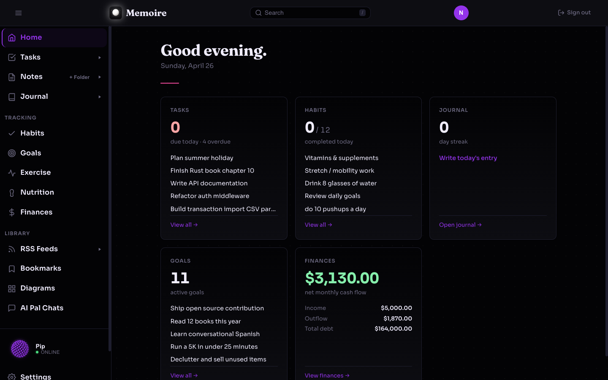
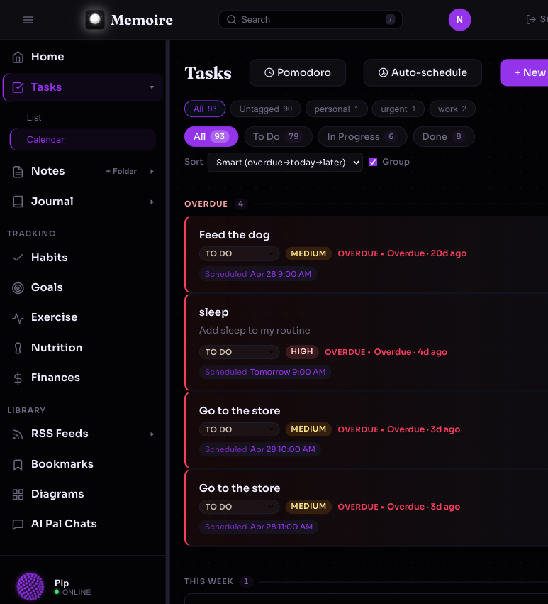
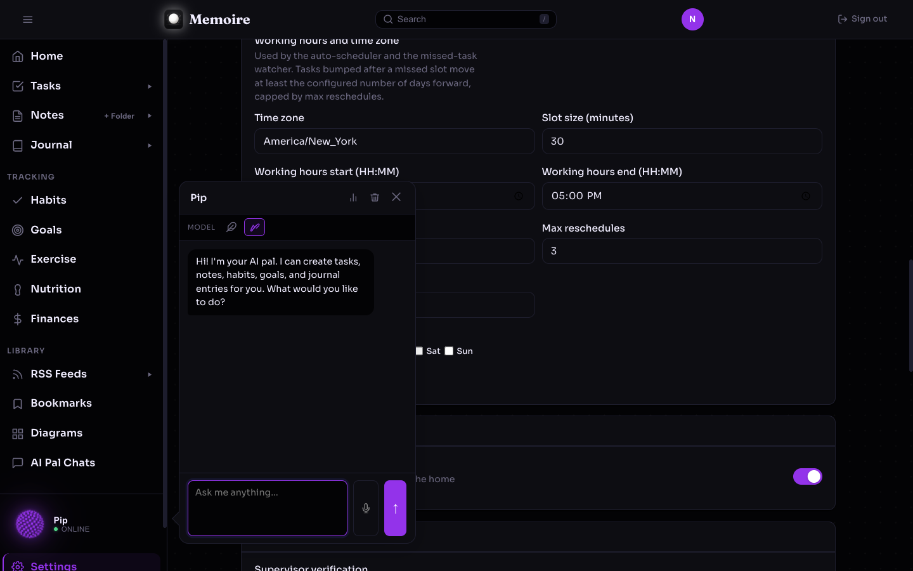

# Memoire

[](https://github.com/neilfarmer/memoire/actions/workflows/ci.yml)
[](https://codecov.io/gh/neilfarmer/memoire)

A self-hosted personal productivity app — tasks, habits, goals, journal, notes, diagrams, nutrition, exercise, and an AI assistant. Deployed entirely on AWS serverless infrastructure via a single Terraform module.

**~$0.30/month** at daily personal use. ~$0 at idle.



---

## What it does

Memoire gives you one place to manage your daily life: track tasks with Pomodoro focus sessions and an auto-scheduler that fits work into your calendar, build habits with streak history, write a daily journal with mood tracking, take notes in a folder tree, draw diagrams with Excalidraw, log meals and workouts, and set long-term goals. An AI assistant (powered by Amazon Bedrock) can create, read, update, and delete data across every feature using plain language.

Everything is multi-tenant by design — each user's data is isolated by Cognito `user_id` at the database level.

### Tasks with tags, scheduling, and an auto-scheduler

Tag tasks instead of foldering them, set an estimated time per task (default configurable in settings), and let the auto-scheduler fit the working week into your free slots.



### AI Pal

Pip is your in-app assistant. Create or update anything — tasks, notes, journal entries, habits, goals — by asking. Backed by Amazon Bedrock with full per-feature tool access.



---

## Features at a glance

| Feature | Highlights |
|---|---|
| Tasks | Status, priority, due dates, tags, estimated time, scheduled blocks + auto-scheduler, week calendar, recurring rules, Pomodoro timer, ntfy push notifications |
| Habits | Daily check-in, current streak, best streak, 30-day heatmap |
| Goals | Title, description, target date, progress tracking |
| Journal | One entry/day, mood, markdown, calendar view, full-text search |
| Notes | Folder hierarchy, markdown editor, image and file attachments, search |
| Diagrams | Excalidraw-powered canvas with list of saved diagrams, inline naming, dark mode |
| Nutrition | Meal logging with USDA-sourced macros, daily totals, calendar view |
| Exercise | Workout logging with sets/reps/weight, calendar view |
| AI Assistant | Conversational Bedrock-powered assistant that acts on all features via tools |
| Export | ZIP of all your data as Markdown files |
| Themes | 11 colour themes |

See [docs/features.md](docs/features.md) for full feature descriptions.

---

## Deploy in 5 minutes

Memoire is a reusable Terraform module. Create a deployment repo with a `main.tf`:

```hcl
provider "aws" {
  region = "us-east-1"
  default_tags {
    tags = { Project = "memoire", ManagedBy = "terraform" }
  }
}

module "memoire" {
  source = "github.com/neilfarmer/memoire//terraform?ref=v0.6.0"

  default_user_email    = "you@example.com"
  default_user_password = "ChangeMe123!"
}

output "frontend_url" { value = module.memoire.frontend_url }
```

```bash
terraform init && terraform apply
```

Then open `terraform output frontend_url` and log in.

Full walkthrough: [docs/getting-started.md](docs/getting-started.md)

---

## Cost

At daily personal use, the only meaningful cost is the AWS Cost Explorer API ($0.01 per home page load). Everything else is within permanent free tier limits.

| Usage | Monthly | Yearly |
|---|---|---|
| Idle (no active users) | ~$0 | ~$0 |
| Light (2 sessions/week) | ~$0.08 | ~$1 |
| Personal daily | ~$0.30 | ~$3.65 |
| Power user (heavy notes, active dev) | ~$0.70 | ~$8.40 |

Full breakdown: [docs/cost.md](docs/cost.md)

---

## Documentation

| Doc | Contents |
|---|---|
| [Getting Started](docs/getting-started.md) | Full deploy walkthrough, prerequisites, first login |
| [Features](docs/features.md) | Detailed description of every feature |
| [Configuration](docs/configuration.md) | All Terraform variables with descriptions and defaults |
| [AI Assistant](docs/features-ai-pal.md) | Architecture, tools, memory system, Bedrock setup |
| [Themes](docs/features-themes.md) | Available themes and CSS variable system |
| [Development](docs/development.md) | Dev workflow, adding a new feature, running tests |
| [Infrastructure](docs/infrastructure.md) | Terraform layout, DynamoDB schema, deployment internals |
| [Cost Analysis](docs/cost.md) | Per-service cost breakdown across usage tiers |
| [Admin Dashboard](docs/features-admin.md) | Bedrock usage stats and admin setup |
| [Considered Features](CONSIDERED_FEATURES.md) | Features evaluated but not yet built |
